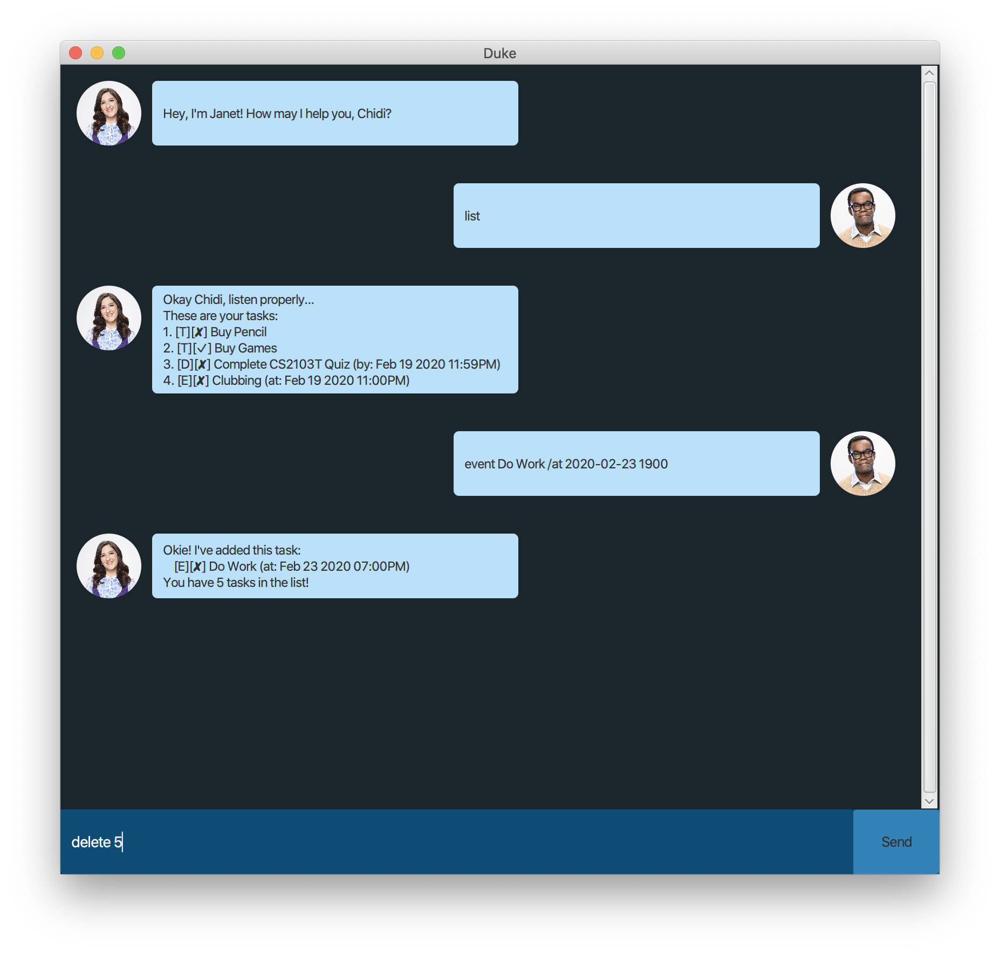

# Duke User Guide

Product Screenshot

## Description
Duke is a simple and interactive task manager that is targeted for users who prefer typing commands. This program is created for the sake of CS2103T. Also, this program is inspired by *The Good Place*.

## Usage

### Creating Tasks
Tasks in Duke are categorised into: To-Do, Deadline and Event tasks.
##### To-Do tasks
To-Do tasks form the basic tasks in Duke. In Duke, you are allowed to set a To-Do task with a description.

##### Deadline tasks
Deadline tasks are tasks that have to be done by a particular date and time. In Duke, you are allowed to set a Deadline task with a description and a date.

##### Event tasks
Event tasks are tasks that have to be done on a particular date and time. In Duke, you are allowed to set an Event task with a description and a date.

##### Command
`todo <description>` - Creates a new To-Do task
`deadline <description> /by <date>` - Creates a new Deadline task
`event <description> /at <date>` - Creates a new Event task

### Listing Tasks
After creating your tasks, you may view the list of tasks that you have added into Duke.
##### Command
`list` - Lists all tasks saved in Duke

### Searching Tasks
You can search for tasks that contain a particular string
##### Command
`find <string_to_match>` - Shows a list of tasks that contain a particular string

### Updating Tasks
Once you have finished your task, you can update the task and mark it as done.
##### Command
`done <task_number>` - Set a task a done

### Deleting Tasks
You can also choose to delete any task from Duke
##### Command
`delete <task_number>` - Permanently deletes the chosen task from Duke

### Closing Duke
##### Command
`bye` - Closes Duke

## Technology
1. Java 11
2. JavaFX 11
3. Gradle